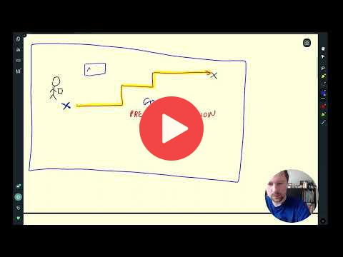
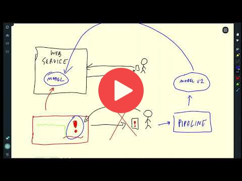

# 1. Introduction

Instructor: Alexey Grigorev

## 1.1 Introduction

<a href="https://www.youtube.com/watch?v=s0uaFZSzwfI&list=PL3MmuxUbc_hIUISrluw_A7wDSmfOhErJK">
  
</a>


## 1.2 Environment preparation

### 1.2.1 GitHub Codespaces
<a href="https://www.youtube.com/watch?v=MzcmWXYxi2s&list=PL3MmuxUbc_hIUISrluw_A7wDSmfOhErJK&index=2">
  
</a>


OR

### 1.2.2 VM in AWS

**Note**: You don't have to rent an instance in the cloud. You can follow the same instructions 
for setting up your local environment. 

<a href="https://www.youtube.com/watch?v=IXSiYkP23zo&list=PL3MmuxUbc_hIUISrluw_A7wDSmfOhErJK">
  
</a>


Code:

Recommended development environment: Linux

### Step 1: Download and install the Anaconda distribution of Python
```sh
wget https://repo.anaconda.com/archive/Anaconda3-2022.05-Linux-x86_64.sh
bash Anaconda3-2022.05-Linux-x86_64.sh
```

### Step 2: Update existing packages

```sh
sudo apt update
```

### Step 3: Install Docker and Docker Compose
Follow the instructions here:
[install-using-the-repository](https://docs.docker.com/engine/install/ubuntu/#install-using-the-repository)  
Set up Docker's apt repository.
```sh
# Add Docker's official GPG key:
sudo apt-get update
sudo apt-get install ca-certificates curl
sudo install -m 0755 -d /etc/apt/keyrings
sudo curl -fsSL https://download.docker.com/linux/ubuntu/gpg -o /etc/apt/keyrings/docker.asc
sudo chmod a+r /etc/apt/keyrings/docker.asc

# Add the repository to Apt sources:
echo \
  "deb [arch=$(dpkg --print-architecture) signed-by=/etc/apt/keyrings/docker.asc] https://download.docker.com/linux/ubuntu \
  $(. /etc/os-release && echo "$VERSION_CODENAME") stable" | \
  sudo tee /etc/apt/sources.list.d/docker.list > /dev/null
sudo apt-get update
```
Install the Docker packages.
```sh
sudo apt-get install docker-ce docker-ce-cli containerd.io docker-buildx-plugin docker-compose-plugin
```
To run docker without `sudo`:

```sh
sudo groupadd docker
sudo usermod -aG docker $USER
```

### Step 4: Run Docker

```sh
docker run hello-world
```

If you get `docker: Got permission denied while trying to connect to the Docker daemon socket at unix:///var/run/docker.sock: Post "http://%2Fvar%2Frun%2Fdocker.sock/v1.24/containers/create": dial unix /var/run/docker.sock: connect: permission denied.` error, restart your VM instance, or run:
`sudo dockerd`

**Note**: If you get `It is required that your private key files are NOT accessible by others. This private key will be ignored.` error, you should change permits on the downloaded file to protect your private key:

 ```sh
chmod 400 name-of-your-private-key-file.pem
```

## 1.3 (Optional) Training a ride duration prediction model

**Note**: The NYC taxi data is now in parquet format, not CSV.
Here's a [video](https://www.youtube.com/watch?v=r94QjpX9vSE&list=PL3MmuxUbc_hIUISrluw_A7wDSmfOhErJK) that explains how to 
read parquet data.

<a href="https://www.youtube.com/watch?v=iRunifGSHFc&list=PL3MmuxUbc_hIUISrluw_A7wDSmfOhErJK">
  
</a>

Links:

* [Notebook](duration-prediction.ipynb)


## 1.4 Course overview

<a href="https://www.youtube.com/watch?v=teP9KWkP6SM&list=PL3MmuxUbc_hIUISrluw_A7wDSmfOhErJK">
  
</a>


## 1.5 MLOps maturity model

<a href="https://www.youtube.com/watch?v=XwTH8BDGzYk&list=PL3MmuxUbc_hIUISrluw_A7wDSmfOhErJK">
  
</a>

Links: 

* [MLOps Maturity model](https://docs.microsoft.com/en-us/azure/architecture/example-scenario/mlops/mlops-maturity-model)


